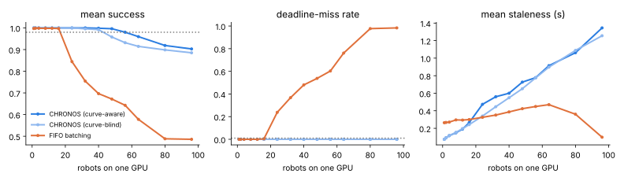
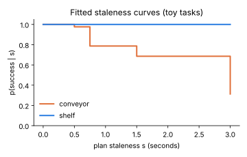
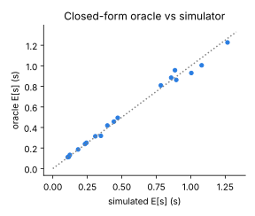

# CHRONOS

Deadline-aware serving for dual-system vision-language-action (VLA) policies.

### ▶ [Try the interactive demo](https://aabhimittal.github.io/CHRONOS/)

The demo runs in your browser. Drag the fleet size, swap schedulers, inject a GPU stall, and watch whether
deadlines or plan staleness breaks first. If the Pages link isn't live yet, use the
[mirror via raw.githack](https://raw.githack.com/aabhimittal/CHRONOS/main/docs/index.html).

[](https://aabhimittal.github.io/CHRONOS/)

LLM serving optimizes throughput. Robot control has deadlines: a late action
isn't a slow response, it's a dropped item. CHRONOS asks how many robots one GPU
can serve if the objective is **robots per GPU, subject to a deadline-miss bound
and a success-rate loss bound**, and what scheduler gets there.

> **Status: simulation only.** No robot hardware, and no real VLA has been
> profiled or rolled out yet. Every number below comes from a toy task and
> illustrative latency constants. It shows the pipeline works and which way
> the effects point. It is **not** a fleet result.

## Idea

Dual-system VLAs (GR00T N1: Eagle-2 VLM + DiT action head) split into a slow
semantic path and a fast action path. The action head runs every control tick
off the *latest* plan. Two quantities decide fleet capacity:

1. **Staleness** `s`: the age of the camera frame behind the active plan. The
   whole project depends on the per-task curve `p(success | s)`.
2. **Scheduling.** Batch VLM refreshes across the fleet, run EDF on the action
   path, and admit robots while `P(miss) ≤ ε`, `E[s] ≤ s_max` and
   `success ≥ dedicated − δ`.

## Results (toy curves, illustrative latencies)

SLO: miss ≤ 1%, E[s] ≤ 1 s, success loss ≤ 2 points. 10 Hz, 50/50 shelf/conveyor mix.

| Scheduler | Robots / GPU | What limits it |
|---|---|---|
| CHRONOS, curve-aware | **54** | success (staleness) |
| CHRONOS, curve-blind | 43 | success (staleness) |
| Closed-form oracle (curve-blind) | 41 | conservative by design |
| FIFO batching, best refresh period | 17 | deadline misses |
| Dedicated | 1 | — |

| Experiment | Result |
|---|---|
| Pick cycle (4 s transit + 2 s conveyor grasp), **phase lookahead** | **58** robots/GPU |
| Same, curve-aware but reacting to the current phase only | 42 |
| Same, curve-blind | 43 |
| 400-robot fleet (300 shelf / 100 conveyor), tasks **mixed** on every GPU | **6** GPUs |
| Same fleet, one GPU pool per task type | 7 GPUs |

How to read this:
- **FIFO and CHRONOS fail for different reasons.** FIFO hits the deadline wall:
  an atomic VLM batch outlasts the action period, while most of its staleness
  budget goes unused. Slicing the VLM work turns a sudden deadline failure into
  gradual staleness.
- **Curve-awareness needs anticipation when tasks have phases.** A robot that
  alternates transit and grasp needs a fresh plan *when the grasp starts*. A
  scheduler that reacts to the current phase refreshes too late, and does no
  better than curve-blind (42 vs 43).
- **Mixing beats segregating here.** A GPU that holds both sensitive and
  insensitive robots can skip the insensitive ones and spend that capacity on
  the sensitive ones. This depends entirely on the curves: with no insensitive
  tasks the advantage disappears.
- **The curve-aware gains are inflated by the toy.** The "shelf" task is almost
  flat in staleness, so skipping it costs nothing. Expect smaller gains on real
  tasks. If every task's curve drops at the same staleness, the scheduler
  reduces to ordinary batching.
- **Compare against tuned FIFO, not dedicated.** CHRONOS vs tuned FIFO (54 vs 17)
  is the ratio worth quoting.

<p>


</p>

## Mechanism

| Component | What it does | Where |
|---|---|---|
| Staleness-injection harness | Wraps any `plan`/`act` policy and forces a refresh every *k* steps with *L* steps of latency. Records the plan age at each step. | `chronos/rollout.py` |
| Hazard model | `P(success) = exp(-Σ_t h(s_t))`, with `h` piecewise-constant and monotone. The fit is convex with a unique optimum. It scores whole staleness traces, so a curve fitted from fixed-period rollouts can score any scheduler. | `chronos/hazard.py` |
| GPU simulator | One non-preemptive GPU. Models network delay and jitter, GPU stalls, robot churn, per-phase tasks, mixed control rates, and a memory cap on VLM batches. | `chronos/sim.py` |
| `ChronosPolicy` | EDF with lazy batching on the action path. VLM work is cut into slices of at most 10 ms so it never blocks a deadline. Frames are captured when a batch launches (pull mode). Batch membership is curve-aware, and with **phase lookahead** a robot is refreshed ahead of its next critical phase. | `chronos/sim.py` |
| `FifoPolicy` | LLM-serving baseline: FIFO order, greedy batching, atomic VLM batches, push-mode frames on a tuned period. | `chronos/sim.py` |
| **Admission oracle** | Closed form for steady-state plan age and an EDF schedulability test (`act(N) + net + guard + one slice ≤ period`). Answers in microseconds when a robot asks to join. Within ±10% of the simulator from 5 to 30 Hz, and every config it calls schedulable has zero misses in the sim. | `chronos/oracle.py` |
| **Multi-GPU placement** | Number of GPUs a fleet needs under mixed vs per-task pools. | `chronos/placement.py` |
| Latency profiler | Times your VLM and action head at several batch sizes and fits `fixed + per·B`, then writes a `LatencyModel` JSON. | `scripts/profile_latency.py`, `chronos/latency.py` |
| Web demo | JavaScript port of the simulator. A parity test checks it matches the Python to 1e-6. | `docs/src/`, `scripts/build_demo.py` |

## Industrial edge cases (tested)

`tests/test_edge_cases.py` checks each of these against the simulator:

| Scenario | Expected behaviour | Verified |
|---|---|---|
| 300 ms GPU stall (driver, thermal, ECC) | misses are bounded to the stall window, and the fleet fully recovers afterwards | ✔ |
| Stall at t = 0 | simulation starts cleanly | ✔ |
| All robots release on the same PLC tick | no deadline misses at 48 robots | ✔ |
| Robots join and leave mid-run | no jobs outside a robot's lifetime; newcomers get a plan refresh | ✔ |
| Mixed 5 / 10 / 30 Hz robots | EDF serves the fastest robots without misses | ✔ |
| VLM overload (160 robots) | CHRONOS keeps every deadline and only staleness grows; FIFO drops more than half its actions | ✔ |
| Action head alone exceeds the period | misses are reported and the run terminates | ✔ |
| Network delay + jitter (5 ± 10 ms) | absorbed in laxity: zero misses, and staleness rises by the network delay | ✔ |
| Memory cap on VLM batch (8) | no batch exceeds the cap under either scheduler | ✔ |
| VLM slice length | no GPU launch exceeds `quantum + overhead` | ✔ |
| Empty fleet; 120 s horizon | no crash; job count exact | ✔ |

## Run

```bash
pip install -e .[dev,docs] && pytest -q            # 46 tests, ~25 s
python scripts/fit_curves.py                        # toy rollouts -> curves/*.json
python scripts/capacity.py                          # headline table (includes the oracle row)
python scripts/profile_latency.py --dummy --out lat.json && python scripts/capacity.py --latency-file lat.json
python scripts/make_report.py                       # every README number + docs/figures, ~2 min
python scripts/build_demo.py                        # rebuild docs/index.html
```

## Known weaknesses / what's not modeled

- **Sim-to-real.** Curves fitted in LIBERO or SimplerEnv may not transfer to
  hardware. The toy env (`ConveyorReach`) only exists to test the pipeline.
- **No real VLA adapter yet.** A LIBERO/SimplerEnv `Env` and a GR00T/π0
  `DualSystemPolicy` still need writing. For π0 and OpenVLA there is no
  separate planner, so "staleness" means open-loop action-chunk execution.
  That is a different quantity, and results must say which one was measured.
- **Latency numbers.** The defaults are made up. Run `profile_latency.py` on
  the real models. The affine model ignores the extra cost of slicing beyond a
  fixed per-slice overhead.
- **GPU model.** One non-preemptive stream per GPU. MPS/MIG spatial sharing and
  cross-GPU migration are not modeled.
- **Hazard independence.** Each step's risk depends only on that step's
  staleness and task. Failures that cluster in time are missed. `h_miss` per
  held step is assumed, not fitted.
- **The oracle is curve-blind,** so for curve-aware scheduling it is a lower
  bound. Its schedulability test is sufficient, not necessary.
- **Capacity moves in steps** because `h` is piecewise-constant. Use finer bins
  once you have enough rollouts.

## Layout

```
chronos/hazard.py     staleness -> success model + convex MLE fit
chronos/rollout.py    staleness-injection harness, toy env
chronos/sim.py        GPU simulator, CHRONOS + FIFO policies, edge-case knobs
chronos/admission.py  SLO + capacity search
chronos/oracle.py     closed-form admission oracle + EDF schedulability test
chronos/placement.py  multi-GPU placement
chronos/latency.py    affine latency fit + timing helper
scripts/              fit_curves, capacity, profile_latency, make_report, build_demo
docs/                 web demo (index.html), figures, results.json
tests/                pytest: hazard, sim, oracle, edge cases, JS/Python parity
```
