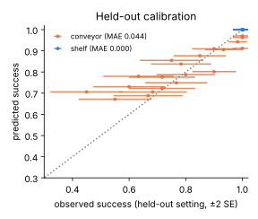

# CHRONOS

Deadline-aware serving for dual-system vision-language-action (VLA) policies.

### ▶ [Try the interactive demo](https://aabhimittal.github.io/CHRONOS/)

The demo runs in your browser. Drag the fleet size, swap schedulers, inject a GPU stall, and watch whether
deadlines or plan staleness breaks first. Its **Findings** table lists every experiment below with a
helps / neutral / hurts tag. If the Pages link isn't live yet, use the
[mirror via raw.githack](https://raw.githack.com/aabhimittal/CHRONOS/main/docs/index.html).

[](https://aabhimittal.github.io/CHRONOS/)

LLM serving optimizes throughput. Robot control has deadlines: a late action
isn't a slow response, it's a dropped item. CHRONOS asks how many robots one GPU
can serve if the objective is **robots per GPU, subject to a deadline-miss bound
and a success-rate loss bound**, and what scheduler gets there.

> **Status: simulation only.** No robot hardware, and no real VLA has been
> rolled out yet. Every number below comes from a toy task and illustrative
> latency constants. The pipeline to replace both is built and tested
> (`chronos/vla.py`, `scripts/fit_curves_vla.py`, `scripts/profile_latency.py`);
> running it needs a GPU machine. It is **not** a fleet result.

## Idea

Dual-system VLAs (GR00T N1: Eagle-2 VLM + DiT action head) split into a slow
semantic path and a fast action path. The action head runs every control tick
off the *latest* plan. Two quantities decide fleet capacity:

1. **Staleness** `s`: the age of the camera frame behind the active plan. The
   whole project depends on the per-task curve `p(success | s)`.
2. **Scheduling.** Batch VLM refreshes across the fleet, run EDF on the action
   path, and admit robots while every SLO below holds.

**SLO** (`chronos/admission.py`):
- deadline misses ≤ 1%;
- mean plan age ≤ 1 s;
- fleet success no more than 2 points below a dedicated GPU;
- **per robot:** the 5th-percentile robot loses at most 5 points against a
  dedicated GPU running its *own* task. This stops a starved minority from
  hiding in the average.

## Headline (toy curves, illustrative latencies)

10 Hz, 50/50 shelf/conveyor mix. Intervals are 90% bootstrap intervals from 20
refits of the curves on resampled rollouts (`scripts/capacity_ci.py`).

| Scheduler | Robots / GPU | 90% interval | What limits it |
|---|---|---|---|
| CHRONOS, curve-aware | **49** | 44–51 | success (staleness) |
| CHRONOS, curve-blind | 33 | 30–43 | success (staleness) |
| Closed-form oracle (curve-blind) | 32 | 30–40 | conservative by design |
| FIFO batching, best refresh period | 17 | 17–17 | deadline misses |
| Dedicated | 1 | — | — |

**Quote CHRONOS vs tuned FIFO (about 2.9×), not CHRONOS vs dedicated.** The
CHRONOS-vs-FIFO gap survives the curve uncertainty. The curve-blind interval
is wide because that policy operates right at the conveyor curve's knee.

## Can the curves be trusted? (Tier 1)

The capacity numbers above are only as good as the curve fit, so it is
checked three ways.

- **Held-out calibration** (`scripts/validate_curves.py`).
  - **Method:** leave each refresh/latency setting out in turn, fit on the rest,
    and predict its success rate. The prediction uses the setting's staleness
    pattern, never the episode's length, so the outcome cannot leak in.
  - **What it found:** the first conveyor curve predicted 0.82 where 0.45 was
    observed at high latency. The cause was experiment design: rollouts tested
    latencies up to 0.3 s, while the simulator runs at 0.1–0.5 s.
  - **After widening the latency grid:** MAE is 0.044, and 0.032 in the operating
    region (mean plan age ≤ 1 s). A residual over-prediction at 0.5 s latency
    remains and is left visible below rather than tuned away.
- **Model form.** The fit can be `ruin`, P = e^(−Σh) (each stale step risks
  breaking the episode), or `opportunity`, P = 1 − e^(−Σc) (each fresh step is a
  chance to succeed). Cross-validation picks the form per task. A 2-D model
  over (plan age, landing latency) was prototyped and rejected because it
  scored worse.
- **Uncertainty.** A stratified bootstrap over the saved rollouts gives the
  intervals above. `scripts/rollout_budget.py` shows that about 20 episodes per
  setting captures most of the precision. For 10 LIBERO tasks on a 30-setting
  grid that is **about 60 GPU-hours** at 0.12 s per step.
- **Per-robot tail.** Curve-aware scheduling widens the tail: its 5th-percentile
  robot loses 3.6 points vs 2.1 for curve-blind. Tightening the per-robot budget
  from 5 to 2 points costs 4 robots (54 → 50 under the earlier curves), and the
  advantage over curve-blind persists.

<p>


</p>

## What worked, what didn't (Tiers 2 and 3)

| | Experiment | Result | Verdict |
|---|---|---|---|
| Feature | **Speed governor**: slow the conveyor so more robots fit | items/hour per GPU **+31%** (60 robots at 0.75× speed vs 40 at full speed) | helps |
| Feature | **Event-triggered refresh** from an on-robot scene-change detector | success 0.875 vs 0.71 age-based (0.3 changes/s, 64 robots); still ahead with a poor detector (0.75 vs 0.71) | helps |
| Feature | **Elastic action head**: fewer denoising steps instead of a missed deadline | misses 98–99% → 0% at 100–160 robots, 30 Hz (quality cost per step count is *assumed*) | helps |
| Feature | **Whittle index** instead of greedy refresh | 24 vs 22 on a fleet mixing gradual and cliff-shaped curves; 48 vs 49 on the toy | small gain |
| Feature | **Spatial partitioning** (MPS/MIG) instead of time slicing | best 44 (36 with 15% interference) vs 49 time-sliced | hurts |
| Systems | **Phase prediction** from current phase + nominal durations (no oracle) | phase jitter σ=0: 46 (oracle 48); σ=0.3: 40 vs 38 current-phase-only; σ=0.6: 30 vs 37 | neutral |
| Systems | **Online admission** with the calibrated oracle, under about 90 offered robots | admits 142/191; 5th-percentile robot 0.97 vs 0.70 when admitting everyone | helps |
| Systems | **Real-clock runtime** (same scheduler on wall time) | 64 robots: 0% misses, plan age 0.80 s vs 0.82 s simulated, scheduler decision p99 2.1 ms | neutral |
| Systems | **Fitted miss cost** `h_miss` (rollouts with dropped actions) | ≈ 0 on the toy vs 0.05 assumed, so it must be measured per real task | neutral |
| Systems | **Cheapest GPU-type mix** for 400 robots | $6.70/h (4 big + 6 mid) vs $6.75/h best single type | helps (small) |
| Systems | Multi-GPU placement, task types mixed vs one pool per task | 7 vs 8 GPUs | helps |

Why the negative results happened:
- **Whittle index (verdict changed).** Its closed form is
  W(a) = a·c(a+L) − ∫_L^{a+L} c(u) du. For a gradual cost it grows as a²/2;
  past a cliff it is constant (tests pin both).
  - A first comparison showed Whittle far *worse* (<8 vs 22 robots).
  - The cause was an unfair setup: greedy looked ahead over the plan's whole
    usage window (out to 2L), while the Whittle score only looked to L. So
    Whittle refreshed cliff robots *after* they crossed the knee, exactly where
    its index saturates.
  - With the same window, Whittle is slightly better on mixed curve shapes
    (24 vs 22). Greedy stays the default because it is simpler and equal on
    the toy.
- **Partitioning.** A dedicated action partition sits mostly idle between
  control ticks. Time slicing hands that idle time to the VLM instead.
- **Phase prediction.** A naive predictor (remaining = nominal − elapsed)
  stopped refreshing robots whose critical phase *overran*. The fixed predictor
  never scores a robot below its current phase. Anticipation pays only while
  phase timing is predictable.
- **Speed scaling.** One curve can't be rescaled to another speed:
  p_v(s) ≠ p_1(s·v), because speed also changes how long episodes run. The
  governor uses one fitted curve per speed level.

Things the real-clock runtime caught that the simulator hid:
- **Coarse preemption.** At large batches a single VLM layer outlasts the
  10 ms slice, so preempting between layers can't honour the quantum. Real VLMs
  need sub-layer (token-chunked) prefill. The policy now budgets the measured
  slice granularity.
- **Scheduler overhead.** Decision time grew with fleet size (p99 5.6 ms at
  64 robots). Vectorizing the refresh selection cut it to 1.7 ms.
- **A timing bug.** A laxity of 1e-17 could make the scheduler "wait" for zero
  time and skip a job. Fixed in Python and in the JS port.

## Mechanism

| Component | What it does | Where |
|---|---|---|
| Staleness harness | Forces a refresh every *k* steps with *L* steps of latency and an optional action-drop rate, and records the plan age at each step. | `chronos/rollout.py` |
| Hazard model | Monotone piecewise-constant rate with a convex fit; ruin/opportunity forms; held-out CV; stratified bootstrap; fitted `h_miss`. | `chronos/hazard.py` |
| Real-VLA adapters | `ChunkPolicy` (π0 / OpenVLA-OFT / GR00T `get_action`), `SplitPolicy` (separate VLM and action head), `LiberoEnv`. | `chronos/vla.py` |
| GPU simulator | One non-preemptive GPU. Models network jitter, stalls, churn, stochastic task phases, mixed control rates, a VLM batch-size cap and denoising steps. | `chronos/sim.py` |
| `ChronosPolicy` | EDF with lazy batching. Sliced VLM work. Curve-aware batch membership (greedy or Whittle). Phase lookahead (oracle or predicted). Elastic action head. | `chronos/sim.py` |
| Admission | Per-robot SLO and capacity search; closed-form oracle with an EDF schedulability test; online controller. | `admission.py`, `oracle.py`, `online.py` |
| Extensions | Speed governor, scene-change triggers, MPS/MIG partitioning, multi-GPU and mixed-GPU-type placement. | `speed.py`, `events.py`, `partition.py`, `placement.py` |
| Runtime | The same policy on a wall clock, with layer-sliced executors. | `chronos/runtime.py` |
| Web demo | JavaScript port of the simulator, checked against the Python to 1e-6. | `docs/src/`, `scripts/build_demo.py` |

## Industrial edge cases (tested)

`tests/test_edge_cases.py` checks each of these:

| Scenario | Expected behaviour |
|---|---|
| 300 ms GPU stall | Misses stay within the stall window; full recovery afterwards. |
| GPU stall at t = 0 | The run starts cleanly. |
| All robots release on the same PLC tick | No misses at 48 robots. |
| Robots joining and leaving mid-run | No jobs outside a robot's lifetime; newcomers get a plan refresh. |
| Mixed 5 / 10 / 30 Hz robots | No misses. |
| VLM overload | CHRONOS keeps deadlines while FIFO drops more than half its actions. |
| Action head slower than the control period | Misses are reported and the run terminates. |
| Network jitter | Absorbed in the scheduler's slack. |
| VLM batch-size cap | Never exceeded. |
| Slice length | No launch exceeds the quantum. |
| Empty fleet; 120 s run | No crash; job count exact. |

`tests/test_tier1.py`, `test_tier2.py` and `test_tier3.py` cover the rest: model
selection, no leakage in held-out prediction, the bootstrap, the per-robot SLO,
the Whittle closed forms, elastic denoising, partitioning, the speed governor,
event triggers, the runtime, the phase predictor, online admission, `h_miss`
recovery and the GPU mix.

## Run

```bash
pip install -e .[dev,docs] && pytest -q                 # 69 tests, ~30 s
python scripts/fit_curves.py && python scripts/validate_curves.py
python scripts/capacity.py                               # headline table
python scripts/capacity_ci.py --boot 20                  # bootstrap intervals, ~20 min
python scripts/make_report.py                            # figures + docs/results.json
python scripts/experiments_tier2.py; python scripts/speed_governor.py; python scripts/experiments_tier3.py
python scripts/runtime_bench.py                          # needs an otherwise idle machine
python scripts/build_demo.py                             # rebuild docs/index.html

# on a GPU machine with LIBERO and your model:
python scripts/profile_latency.py --out latency.json     # edit load_fns() first
python scripts/fit_curves_vla.py --suite libero_10 --tasks 0,1,2 --policy mypkg:make_policy
python scripts/rollout_budget.py --sec-per-step 0.12 --tasks 10
```

## Known weaknesses

- **Toy curves.** Every capacity number depends on them. The LIBERO path is
  built but has not been run (no GPU here). The adapter follows OpenVLA's eval
  sequence but is untested in this repository.
- **Calibration residual.** The conveyor curve still over-predicts at 0.5 s
  latency. The hazard model scores per-step staleness, but for catching a
  moving target *when* the fresh moments happen also matters.
- **Assumed parameters:**
  - the quality cost of fewer denoising steps;
  - the scene-change and detector model behind event triggers;
  - GPU-type latency scaling and prices.
- **Linear-share GPU model.** Partitioning assumes speed scales linearly with
  the GPU share, which is optimistic for small MIG slices.
- **Runtime.** It uses sleep-based or numpy executors; there is no CUDA-streams
  path yet, and wall-clock results include OS timer jitter.
- **Oracle.** It is curve-blind and needs an offline calibration factor (1.53
  here) to stop under-admitting.
